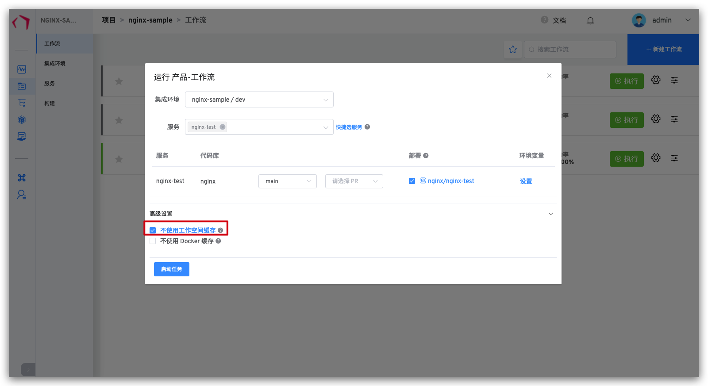
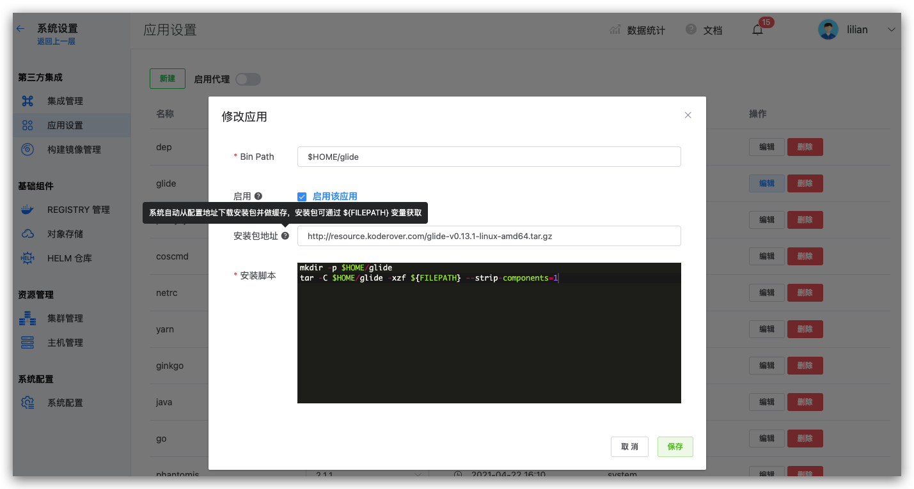

本文主要介绍工作流中构建步骤的缓存机制。Zadig 构建支持工作空间缓存、自定义目录缓存、应用缓存和镜像缓存。Zadig 的缓存无需配置，完全自动化。使用缓存可以提升工作流构建效率。

## 工作空间缓存
Zadig 工作流执行构建任务时默认会将本次任务的工作空间（WORKSPACE）缓存到集成的对象存储中。
工作空间的缓存机制：
1. 同一工作流，不同服务都有独立的工作空间缓存，互不影响。
2. 不同工作流，相同服务都有独立的工作空间缓存，互不影响。

工作空间可能包含以下内容：
1. 构建时拉取的代码和依赖
2. 构建过程产生的一些临时文件
3. 构建产物

某些业务场景下可能不希望使用缓存，或者临时不使用历史缓存进行构建，那么可以通过调整缓存配置达到不使用缓存的目的。

* 如果在构建中长期不使用缓存，可以在`项目` -> `构建`，选择对应构建脚本，关闭 `使用工作空间缓存`，如下图所示。

* 如果临时不使用历史缓存，可以在启动工作流时，在`高级设置`中，选择`不使用工作空间缓存`，如下图所示。

## 自定义目录缓存
如果您的工作空间过大，这种情况下，使用工作空间缓存会增加构建时长，大大影响构建效率。建议您使用`缓存自定义目录`功能，仅缓存必要的目录。 
您可以在构建模块中，配置`缓存自定义目录`，系统支持缓存多个自定义目录，如下图所示。

## 应用缓存

在 Zadig 系统上执行服务构建以及测试时，一般都需要根据实际业务去安装必要的应用环境。比如编译后端相关代码就需要 Go 环境、Java 环境等，编译前端代码可能需要 NodeJS 等应用，具体配置请参阅[应用设置](/v1.6.0/settings/app/)。这些应用会被缓存在系统内置的对象存储中。

