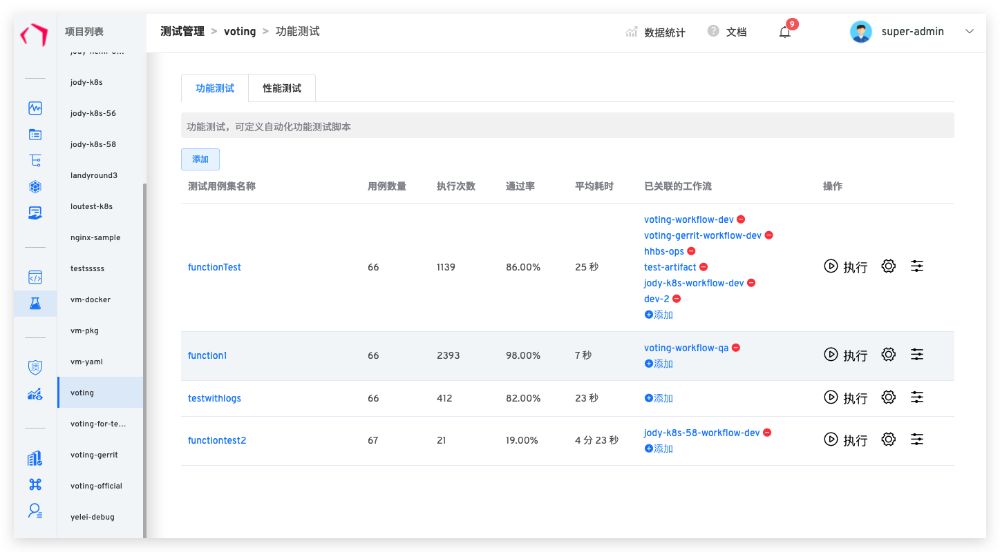
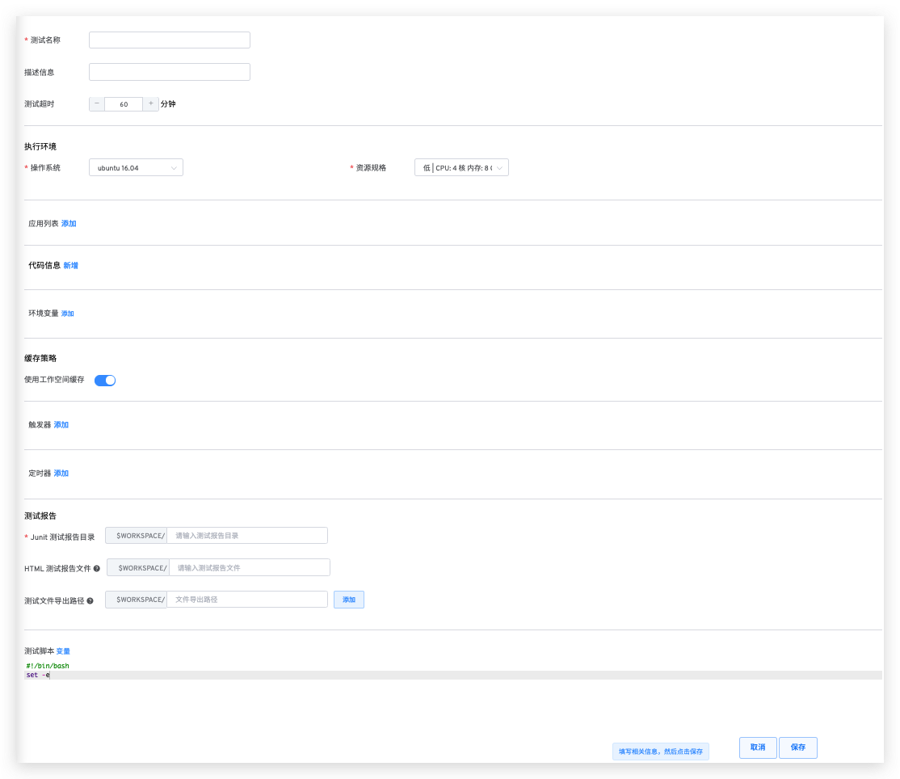

测试模块主要用于执行自动化测试，支持功能测试，支持标准 Junit 测试报告输出。

## 测试管理

- `测试管理`：跨项目用例可共享，支持多类型例如功能、UI、性能自动化管理；
- `测试执行`：支持 CI/CD 并发执行、单独执行、跨环境执行；
- `测试分析`：单场景耗时、通过率分析，跨团队测试效益、健康度分析；

## 测试配置

### 参数设置

- **执行环境**：测试脚本执行的环境包括测试过程中需要的系统环境和安装在系统上的工具；

  - 操作系统目前仅支持 Ubuntu；
  - 常见版本 Ubuntu 16.04 、Ubuntu 18.04 和 Ubuntu 20.04；

- **应用列表**

  - `应用`：编译过程中需要用到的各类工具，比如不同版本的 Java、Go、Govendor、Node、Bower、Yarn、Phantomjs 等等。目前系统内置 Jmeter、Ginkgo、Selenium 常见工具。
  - 如果有其他应用或者版本需求，系统管理员可以在 `系统设置` -> `应用设置` 中配置应用工具的安装脚本。

- **代码信息**

  - `代码库拥有者（Repo Owner）`：KodeRover 支持开源库和组织下的所有代码；
  - `代码库名称（Repo）`：代码库的名称；
  - `默认分支（Branch）`：创建工作流任务时，默认选取的分支，与高级配置中的默认设置配合使用，可以限制每次编译的 Branch；

- **环境变量**

  - `敏感信息`：若编译脚本中存在敏感信息，如 Access Key Id、Secret Access Key 等信息，可以设置敏感信息来隐藏控制台 Console 输出。配置后，可在测试脚本中作为环境变量使用；

- **缓存策略**

  -`使用工作空间缓存`：开启后，执行测试任务时，会使用上次任务的工作空间缓存，缓存内容包括代码仓库以及测试任务产生的文件。

- **触发器**

  - [x] `GitLab`
  - [ ] `GitHub`（后面会支持）
  - [ ] `Gerrit`（后面会支持）

- **定时器**：通过配置定时任务，可以实现周期性的运行测试，目前工作流支持的定时任务方式主要有

  - `定时循环`：在某个时间点定时执行某个测试，例如每天 12：00 运行，每周一 10：00 运行；
  - `周期循环`：周期性的执行某个任务，例如每 30 分钟 执行一次测试；
  - `Cron 表达式`：使用 Cron 表达式定义执行时间；

- **测试报告**:

  - `Junit 测试报告目录`：支持标准的 Junit Xml 测试报告的解析。
  - `Html 测试报告文件`：如果有生成 Html 测试报告并且在工作流中添加通知模块，系统会自动发送工作流执行的测试任务结果到 IM 中。
  - `测试文件导出路径`：可以设置一个或者多个文件目录，测试任务完成后可以在工作流详情页面进行下载，通常用于测试日志等文件的导出；

- **测试脚本**：用户可在脚本里使用如下环境变量：

| 变量名称     | 作用         |
| ------------ | ------------ |
| `WORKSPACE`  | 工作目录     |
| `LINKED_ENV` | 被测命名空间  |
| `ENV_NAME`   | 被测环境名称  |
| `TEST_URL`   | 测试任务的 URL|

### 具体配置

#### 代码仓库高级配置

配置参数：

- `Remote name`：指定远程仓库名称，默认 origin；
- `克隆目录名`：git clone 存放的路径；
- `子模块`：同步 Submodule 中配置的代码库；
- `默认设置`：开启后，创建工作任务时不提供参数化方式，使用 pipeline 设置中的默认配置执行；

#### webhook 配置

通过设置一个或者多个库的 webhook 来触发测试任务，如下图所示：

点击添加按钮新增一个 webhook，触发器的代码库以及目标分支会自动从测试配置的代码库列表中加载，可以选择不同的事件进行触发：

参数说明：

- `代码库`：需要监听触发事件的代码仓库；
- `目标分支`：提交 PR 时的 Base 分支；
- `触发事件`：`push` 事件（ Merge 操作）时触发，`pull_request` 提交 PR 时触发；
- `自动取消`：如果你希望只运行最新的提交所触发的测试，则使用这个选项会自动取消队列中的任务；
- `文件目录`：通过设置监听的文件和目录白名单，可以忽略白名单之外的文件变更，不进行触发工作流。主要用于设置需要匹配的文件目录，如果配置中的文件目录有新增、修改或者删除操作就会触发工作流任务。“/”表示代码库中的所有文件；用“!”符号开头可以排除相应的文件。例如目录 `Test` 下所有非 `.md` 文件改动触发某个工作流，可以设置为 `test,!.md`；

#### 定时循环

点击添加按钮添加一项定时循环条目，分别选择周期时间以及时间点：

#### 间隔循环

点击添加按钮添加一项间隔循环条目，分别选择周期时间以及时间点：

#### Cron 表达式

点击添加按钮添加一项 Cron 表达式条目，输入 Cron 表达式：

