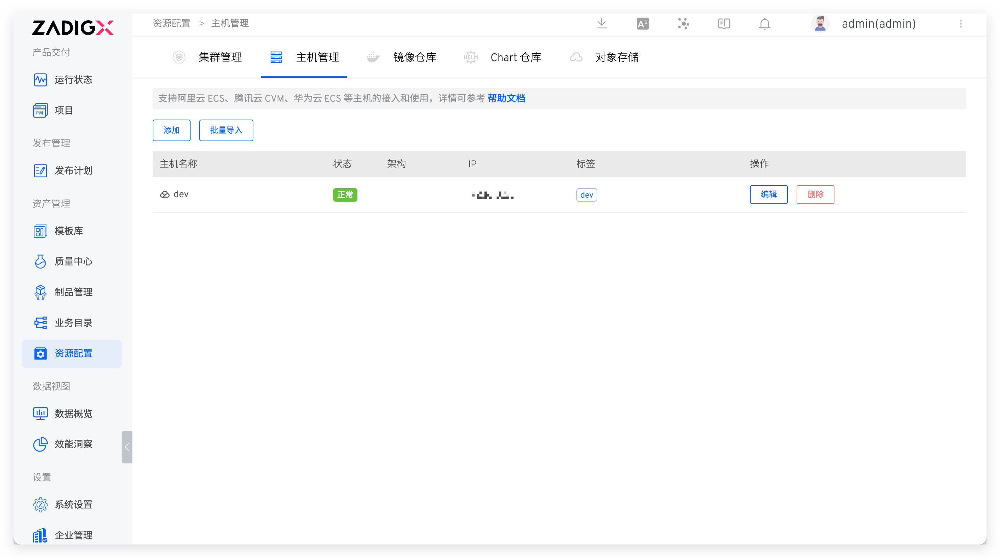
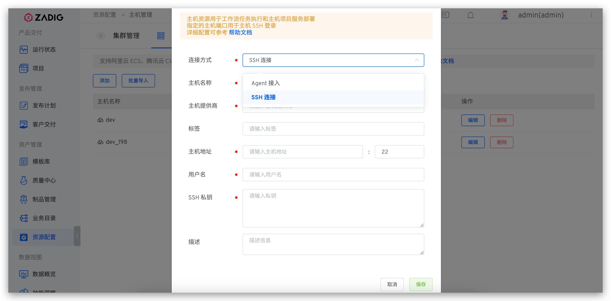
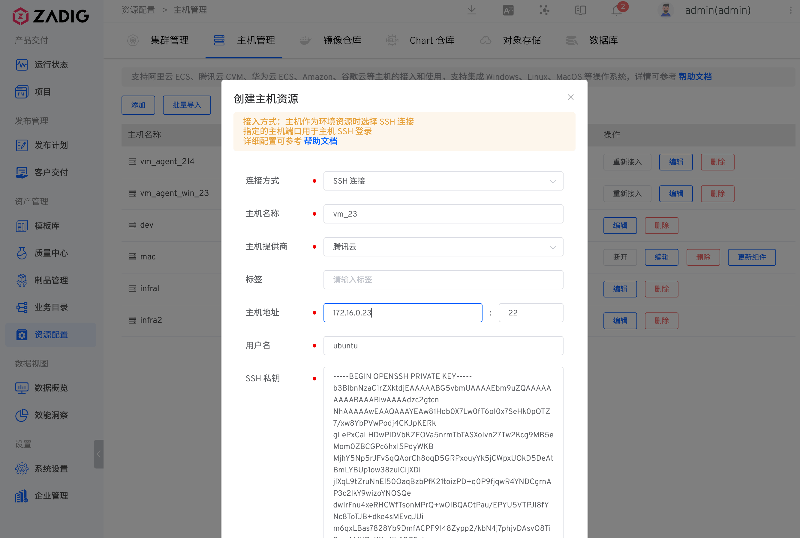
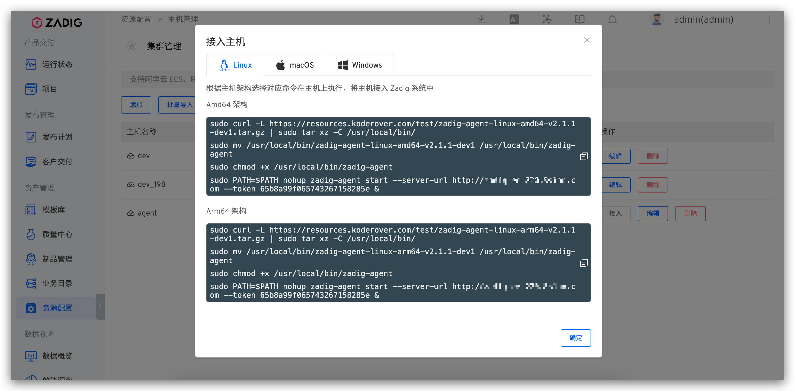

本文介绍如何在 Zadig 系统上进行主机管理，支持接入 Linux、MacOS、Windows 系统，同时支持 AMD 和 ARM 架构。

支持两种接入方式，使用场景有所不同：
- SSH 连接：主机作为环境资源
- Agent 接入：作为工作流任务节点

## 查看主机

访问`资源配置` -> `主机管理`中可查看所有主机资源，系统会基于高级设置中的探活配置，定时（每 10 秒）检测主机在线状态。



## 添加主机

访问 `资源配置` -> `主机管理`，点击`新建`，填写参数后保存。



参数说明：
- `连接方式`：
    - `SSH 连接`：主机作为环境资源时选择 SSH 连接
    - `Agent 接入`：主机作为工作流任务节点时选择 Agent 接入
- `主机名称`：自定义，用于标识主机的名称
- `标签`：自定义主机标签，用于快速识别主机资源
- `主机地址`：主机的访问地址及端口，端口值默认为 22
- `用户名`：主机登录用户名
- `登录主机`：若开启，在环境中可登录主机
- `SSH 私钥`：用于登录鉴权
- `任务根目录`：用于调度工作流任务时，任务的工作目录
- `任务并发数`：执行工作流任务的并发数

### SSH 方式接入

> 作为主机环境资源



1. 步骤一：在主机的 $HOME/.ssh 目录下执行以下命令生成 SSH 密钥对

```bash
ssh-keygen -t rsa -C "your_email@example.com"
```
2. 步骤二：将生成的公钥追加到 $HOME/.ssh/authorized_keys 文件中

```bash
cat id_rsa.pub >>  authorized_keys
```
3. 步骤三：将生成的私钥 id_rsa 填入上图私钥字段中

### Agent 方式接入

> 作为工作流任务节点

保存主机基本信息后，根据主机架构选择对应命令在主机上执行。



### 批量导入主机

管理员访问 `资源配置` -> `主机管理`，点击`新建`


参数说明：

- `下载模板`：导入的主机文件内容需符合 Zadig 给出的模板文件中定义结构。
- `上传文件`：根据模板文件修改，上传修改后的主机列表文件。
- `导入选项`：
    1. 增量：主机管理列表中已有条目不会重新导入，仅添加文件中新增的主机信息。
    2. 覆盖已有主机：主机管理列表中的已有条目重新导入且添加文件中新增的主机信息。

## 主机使用

### SSH 方式接入

主机服务添加资源配置，支持两种选择方式：“主机标签” 和 “主机名称”。


可通过 `环境`，点击服务，查看服务部署详情。


### Agent 方式接入

构建、通用任务运行环境-基础设施选择「主机」，选择对应的执行主机标签，即可在对应主机上执行工作流任务。

