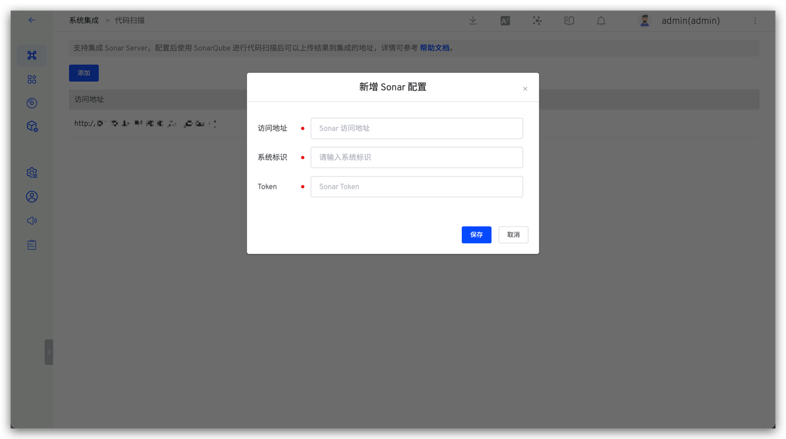

本文主要介绍如何在 Zadig 平台上，利用不同的扫描工具执行 Sonar 代码扫描，从而提高软件开发的效率和质量。通过详细的操作示例和配置说明，读者将了解到在 Zadig 上如何配置和使用 Maven、Gradle 以及 SonarScanner 等工具进行代码扫描的过程，为项目的质量控制提供了有力支持。此外，本文还探讨了 Zadig 代码扫描的进阶使用方法，如代码变更触发、开启质量门禁以及代码扫描模板的应用，旨在帮助开发团队更好地利用 Zadig 平台实现代码质量管理的自动化和规范化。

## 准备工作

在 Zadig 使用代码扫描需先集成 Sonar Server，具体方式参考[文档](/Zadig%20v3.2/settings/sonar/)。



下面通过具体例子详细介绍不同的 Sonar 扫描工具如何在 Zadig 上配置和使用。

## 不同 Sonar 扫描工具的使用

根据 Sonar 的官方说明，不同语言的 sonar 分析过程、内容和产生的分析结果各异。部分语言比如 JAVA、C#  等需针对编译后的文件 .class 、.dll 等进行分析，所以采用的扫描工具存在差异，一般 JAVA 使用 maven 来做 sonar 扫描；而 Gradle 项目可直接使用 gradle 做代码扫描，更为便捷；其他语言可以采用 SonarScanner CLI 执行扫描过程，Zadig 对此作了深度集成，无需额外下载、设置和维护 SonarScanner CLI ，减少工具本身的维护和管理负担。此外，Zadig集中管理 Sonar Server 地址和 Token 信息，在执行代码扫描时自动注入，无需额外配置，减轻管理负担，同时提升安全性。

### Maven

以 Spring Boot 项目为例，介绍在 Zadig 上如何配置和使用 Maven 进行代码扫描，项目源码参考：[spring-boot-demo](https://github.com/koderover/zadig/tree/main/examples/spring-boot-demo)。


配置说明：
- 扫描环境：基础运行环境
- 依赖的软件包：选择对应版本的 JAVA 和 Maven，软件包的管理参考[文档](/Zadig%20v3.2/settings/app/)
- Sonar 地址：选择集成的 Sonar Server 地址
- 代码信息：项目源码仓库地址
- 扫描脚本：

```bash
#!/bin/bash
set -e

cd $WORKSPACE/zadig/examples/spring-boot-demo
mvn clean verify sonar:sonar -Dsonar.projectKey=$PROJECT -Dsonar.projectName=$PROJECT -Dsonar.working.directory=$WORKSPACE/$REPONAME_0/.scannerwork  -Dsonar.host.url=$SONAR_URL

```

其中：
- `$PROJECT`：当前项目标识
- `$SONAR_URL`：Sonar Server 地址


### Gradle

以 Gradle 项目为例，介绍在 Zadig 上如何配置和使用 Gradle 构建工具进行代码扫描，项目源码参考：[sonarqube-scanner-gradle](https://github.com/koderover/zadig/tree/main/examples/sonarqube-scanner-gradle)


配置说明：
- 扫描环境：基础运行环境，可选择官方的 sonar 镜像，也可自定义镜像（必须包含 Java）
- Sonar 地址：选择集成的 Sonar Server 地址
- 代码信息：项目源码仓库地址
- 扫描脚本：

```bash
#!/bin/bash
set -e

cd zadig/examples/sonarqube-scanner-gradle
./gradlew -Dsonar.host.url=$SONAR_URL -Dsonar.working.directory=$WORKSPACE/$REPONAME_0/.scannerwork sonar

```

其中：
- `$SONAR_URL`：Sonar Server 地址

### SonarScanner

以 Go 项目为例，介绍在 Zadig 如何使用 Sonar Scanner CLI 进行代码扫描，项目源码参考：[multi-service-demo](https://github.com/koderover/zadig/tree/main/examples/multi-service-demo)


配置说明：
- 扫描环境：基础运行环境，可选择官方提供的 sonar 镜像；也可自定义镜像（必须包含 Java 和 sonar-scanner）
- Sonar 地址：选择集成的 Sonar Server 地址
- 代码信息：项目源码仓库地址
- SonarScanner 扫描：添加步骤填写 sonar 扫描参数，例如：

```
# Sonar Parameter
sonar.projectKey=multi-service-demo
sonar.projectName=multi-service-demo
sonar.sources=./examples/multi-service-demo
sonar.go.file.suffies=.go

```

## 进阶使用

### 代码变更触发

开发人员完成代码编写后，通常希望及时获得代码质量反馈。Zadig 支持代码变更自动触发执行代码扫描，并将结果反馈到代码的 MR/PR 上，为代码审核提供客观依据。

- **配置触发器**：编辑代码扫描 > 添加代码变更触发器。


- **效果展示**：在 GitLab 上提交代码，创建 Merge Request，自动触发代码扫描，并在 MR 上获得扫描结果。


### 开启质量门禁

通过设置质量门禁，可以在提交代码前对其进行严格的质量检查，以确保它符合预先定义的质量标准和规范。这样做有助于提高代码质量，减少技术债。SonarQube 支持为项目设置这样的质量门禁规则，在 Zadig 中开启"质量门禁检查"后，系统会应用 Sonar 上的质量门禁规则。如果扫描任务满足了规则条件，则任务通过；如果不满足条件，则任务失败。


### 代码扫描模板

对于有多个代码仓库且扫描过程相似的情况，单独管理每个代码库的扫描过程会增加维护负担。为了减轻这种负担，Zadig 提供了代码扫描模板的功能，允许多个代码库共享同一份模板。这样，当扫描过程需要更新时，只需修改模板，关联的所有代码库的扫描过程就会同步更新，大大减少了维护的工作。

- **配置模板**：模板库 > 添加并配置代码扫描模板。


- **使用模板**：新建代码扫描 > 选择「使用模板」并选择模板 > 填写代码信息。

