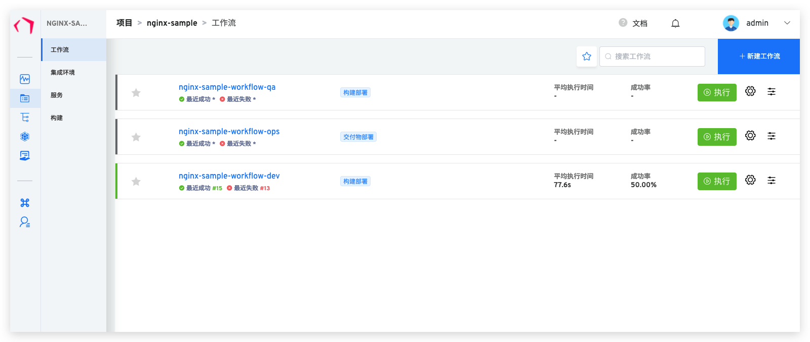
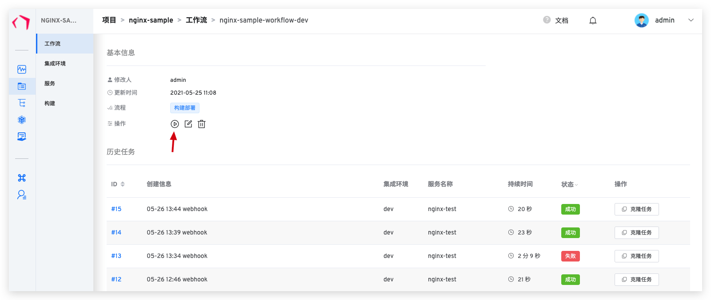
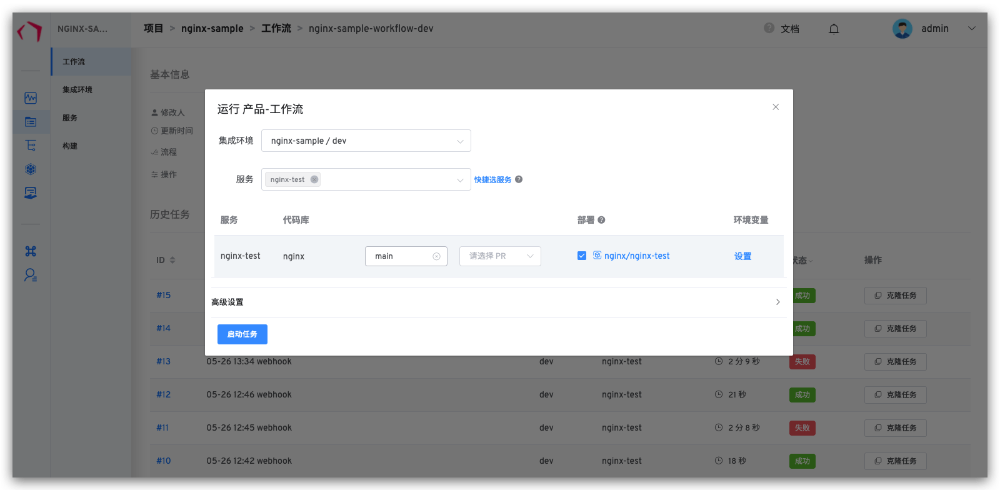
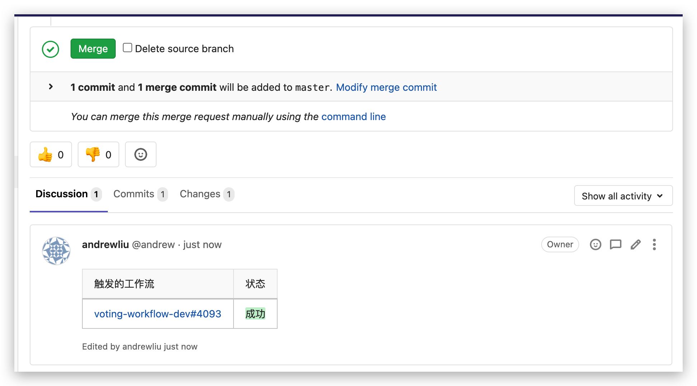
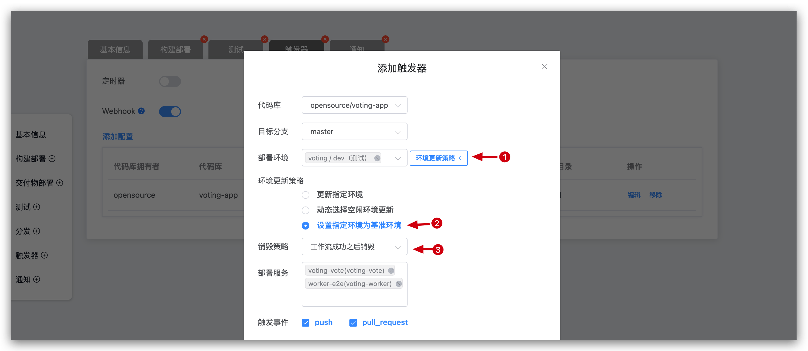
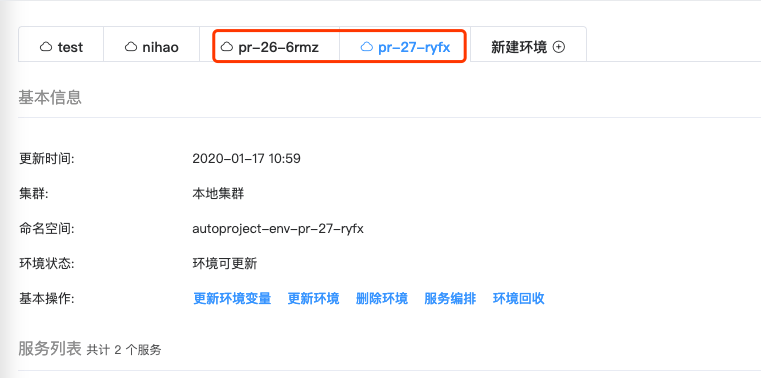
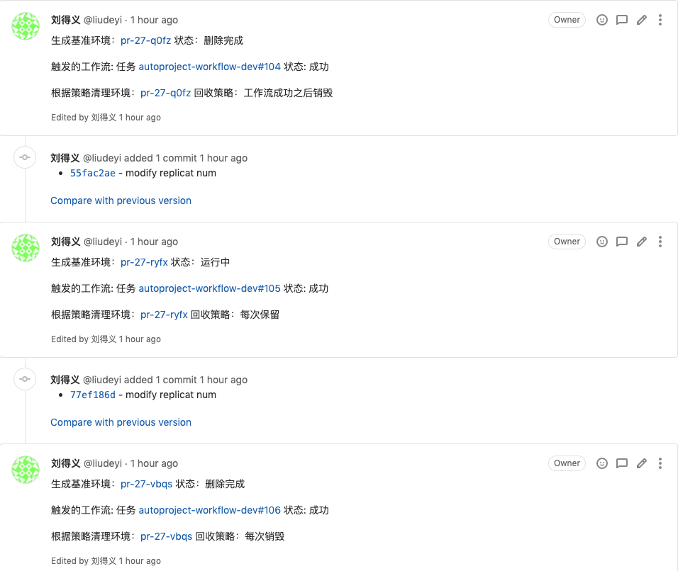

本文主要介绍 Zadig 工作流的三种触发方式：手动触发、定时器触发和代码库变更触发。

## 手动触发工作流

手动触发的两个入口：
- 工作流列表页
- 工作流详情页入口

### 工作流启动入口-列表页

点击列表中工作流右侧对应的“执行”按钮，启动工作流。

### 工作流启动入口-工作流详情页

点击工作流操作中的“执行”按钮，启动工作流。

### 工作流启动参数说明

从以上两个入口点击“执行”按钮之后，都会弹出启动工作流，如下图所示。

参数说明：

- `集成环境`：选择此次任务所要更新的集成环境。
- `服务`：选择此次任务更新的服务名称。
- `代码选择`：用户完成选择服务后，可以自由选择代码信息，Zadig 提供四种代码构建方式：
    - 选择某个 Branch ，系统会拉取该 Branch 的代码进行构建。
    - 选择某个 Branch + PR 构建，系统会在工作目录中将 PR 自动合并到所选 Branch 后进行构建。
    - 选择某个 PR ，系统会拉取该 PR 的代码进行构建。
    - 选择 Tag 构建，工作流中有分发步骤时，用户可选择 Branch 或者 Tag 进行构建。
- `环境变量`：构建和测试脚本中设置的自定义环境变量，在启动工作流时候可以传入具体的值。

## 定时器触发

在工作流触发器中，可以通过工作流的定时器功能来配置工作流的定时任务。具体配置请参阅[定时器](/project/workflow/#定时任务)。

## 代码库变更触发

代码库的变动可以触发工作流执行，可以通过工作流的 Webhook 功能来配置工作流的自动触发。具体配置请参阅 [Git Webhook](/project/workflow/#git-webhook)。

配置完成后，根据配置提交 pull request、merge 或者 push 可触发工作流，以 GitLab 为例，在 pull request中可以查看工作流的反馈信息，如下所示。

## PR 独立测试环境验证

::: warning
PR 独立测试环境验证功能目前仅支持 GitLab 代码仓库触发
:::

> 通过工作流 Webhook 中配置基准环境和环境销毁策略实现 PR 独立测试环境的持续交付过程，完成一段代码的全生命周期质量验证。

PR 级持续交付分为以下步骤：
- 提交更新的 PR 代码
- 根据选择的基准环境生成一个相同服务版本的临时环境
- 执行工作流更新该测试环境中的服务版本，以及针对该集成环境进行相关自动化、性能等测试验证
- 根据环境销毁策略对测试环境进行回收操作

具体配置如下图所示：

通过 PR 触发生成的，具体内容如下图所示：

具体效果内容如下图所示：

