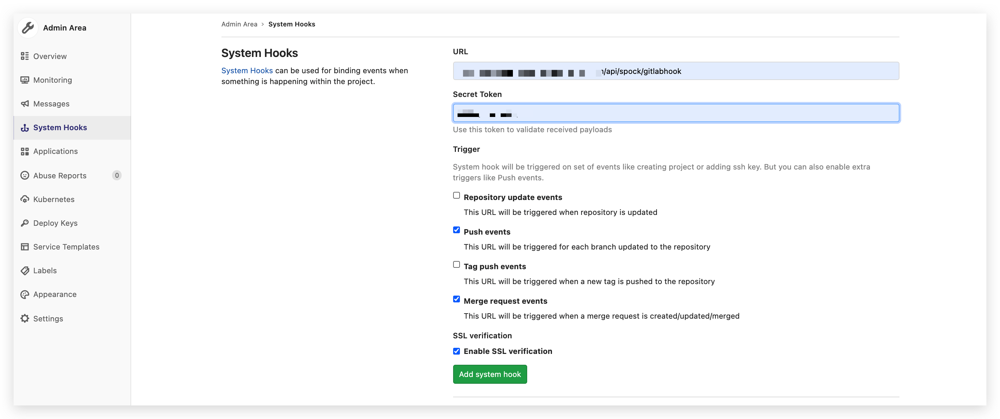
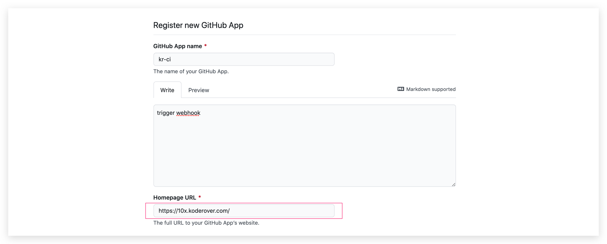
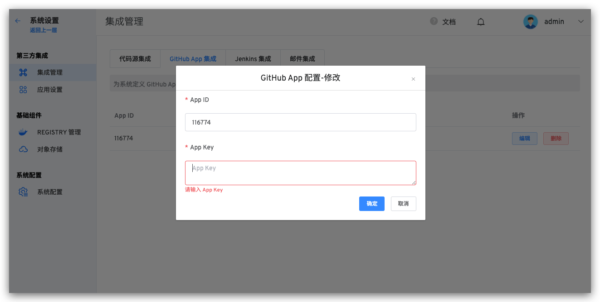

本文主要介绍如何在代码托管平台正确配置 Zadig 的 Webhook 。
> Webhook 可用于以下场景： 
> 1. 通过配置工作流 Webhook 可以实现代码 Push 到代码库以及提交 Pull Request(Merge Request) 时触发工作流的运行，实现从提交到构建自动化的流程。具体可以参考[工作流的触发](/workflow/trigger/) 
> 2. 通过 Webhook 可以实现在代码仓库中托管的服务配置变更实时同步到 Zadig 系统上

::: tip 提示
<Badge text="v1.3.0 及以上"/> 版本中，系统会自动在 Git 仓库添加 Webhook 配置，无需手动配置
:::

## GitLab Webhook 配置 1.3.0 以下版本适用

代码触发 Zadig 工作流，需要在 GitLab 上配置相关的 Webhook。`Admin Area` -> `System Hooks`，具体配置如图所示：

参数说明：
- `URL`：`[Zadig 系统部署的 URL]/api/aslan/gitlabhook`
- `Secret Token`：用于验证 Payloads，点击用户头像：用户设置 -> 密钥，复制密钥
    > 企业版可以在`企业管理` -> `企业信息`位置查找密钥信息
- `Trigger`：选择 `Push events` 和 `Merge request events`
- `SSL verification`：选择 `Enable SSL verification`

> 也可以配置 GitLab 项目级别的 Webhook 触发，选择具体的 GitLab 项目，点击 `Settings` -> `integrations`，具体配置可参考上图。

## GitHub Webhook 配置 1.3.0 以下版本适用

Zadig GitHub Webhook 采用的是 GitHub App 的方式，具体配置过程如下：

### 第 1 步：创建 GitHub App
organization owner 在组织的 settings 中创建一个 GitHub App，并且将创建的 APP 安装到 GitHub organization 下。
> 个人账号通过 `Settings` -> `Developer setting` -> `GitHub Apps`，点击 `New GitHub App`创建 GitHub App。

<strong>APP 配置如下：</strong>
1. 填写 GitHub App name 和 Homepage URL：
  

参数说明：
- `GitHub App name`：自定义
- `Homepage URL`：Zadig 系统部署的 URL

2. 填写 Webhook 配置：
  

参数说明：
- `Active`：选中
- `Webhook URL`：`[Zadig 系统部署的 URL]/api/aslan/githubWebHook`
- `Webhook Secret`：用于验证 Payloads，登录 Zadig，点击用户头像：用户设置 -> 密钥，复制密钥
> 企业版可以在`企业管理` -> `企业信息`位置查找密钥信息

3. Repository permissions：
    * `Checks`：Read & write
    * `Contents`：Read-only
    * `Metadata`：Read-only
    * `Pull requests`：Read-only
    * `Commit statuses`：Read & write
4. Subscribe to events：
    * 勾选 `Check run`、`Pull request`、`Push`
5. 点击 `Create GitHub App` 创建 GitHub App。

### 第 2 步：下载 .pem 文件并进行加密
在创建的 GitHub App General 界面，点击 `Generate a private key` 生成 Private key，并对下载 .pem 文件的内容进行 `Base64 加密`：

### 第 3 步：安装 GitHub App
将 GitHub App 安装到 organization 下。点击 App 头像进入创建的 GitHub App 通用界面，进入 `Install App`，选择 `Install`：

> 进行到这一步，GitHub 的配置操作完成。

### 第 4 步：在 Zadig 系统上集成 GitHub App
`第 4 步`：进入 Zadig，`系统设置` -> `集成管理` -> `GitHub App 集成`，填写 App ID 和加密过的私钥，如图所示：

参数说明：
- `App ID`：第 3 步生成的 GitHub App 的 ID
- `App Key`：第 2 步下载的 .pem 文件的 Base64 编码

## Gerrit Webhook 配置

Gerrit Webhook 需要 Webhook 插件支持。具体安装请参考[链接](https://gerrit-review.googlesource.com/Documentation/config-plugins.html#installation)。

安装成功之后，效果如图所示：

