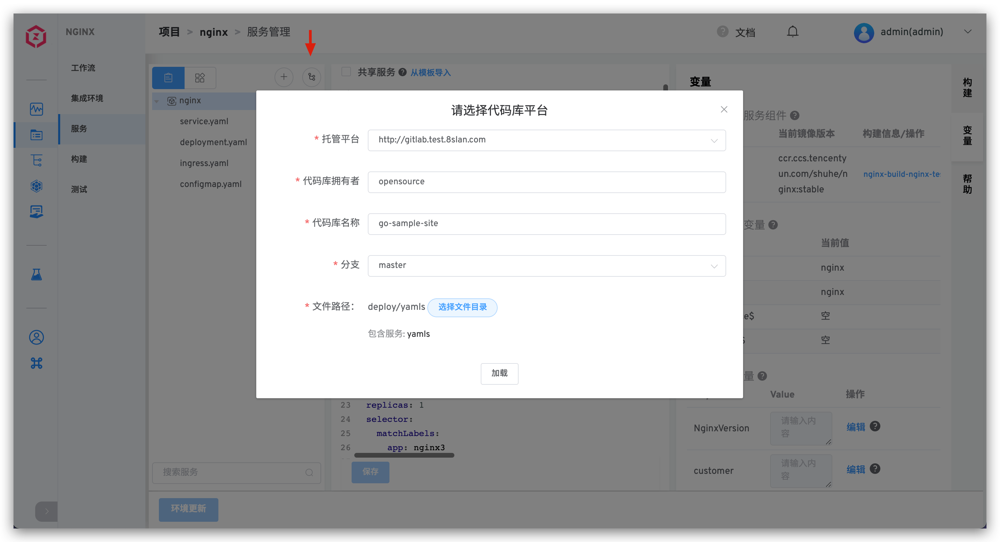

本文主要介绍如何在代码托管平台正确配置 Zadig 的 Webhook 。
::: tip Webhook 可用于以下场景
1. 通过配置工作流 Webhook 可以实现代码 Push 到代码库以及提交 Pull Request(Merge Request) 时触发工作流的运行，实现从提交到构建自动化的流程。具体可以参考[工作流的触发](/workflow/trigger/) 
2. 通过 Webhook 可以实现在代码仓库中托管的服务配置变更实时同步到 Zadig 系统上
:::

## GitHub / GitLab Webhook 配置

在 Zadig 系统中做相关配置后，会自动在 GitHub / GitLab 平台创建 Webhook。

### 配置工作流 Webhook

为工作流配置 Webhook 触发器，按需配置 GitHub / GitLab 代码仓库。配置完毕，Zadig 系统会自动在  GitHub / GitLab 系统中创建 Webhook。

### 从代码仓库导入服务

新建服务时选择从代码仓库导入，按需配置 GitHub / GitLab 代码仓库。服务创建完毕，Zadig 系统会自动在 GitHub / GitLab 系统中创建 Webhook。

## Gerrit Webhook 配置

Gerrit Webhook 需要 Webhook 插件支持。具体安装请参考[链接](https://gerrit-review.googlesource.com/Documentation/config-plugins.html#installation)。

安装成功之后，效果如图所示：

