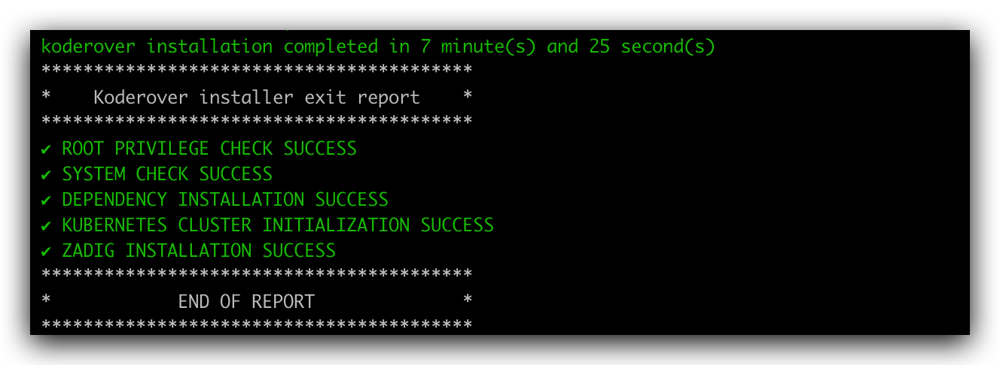
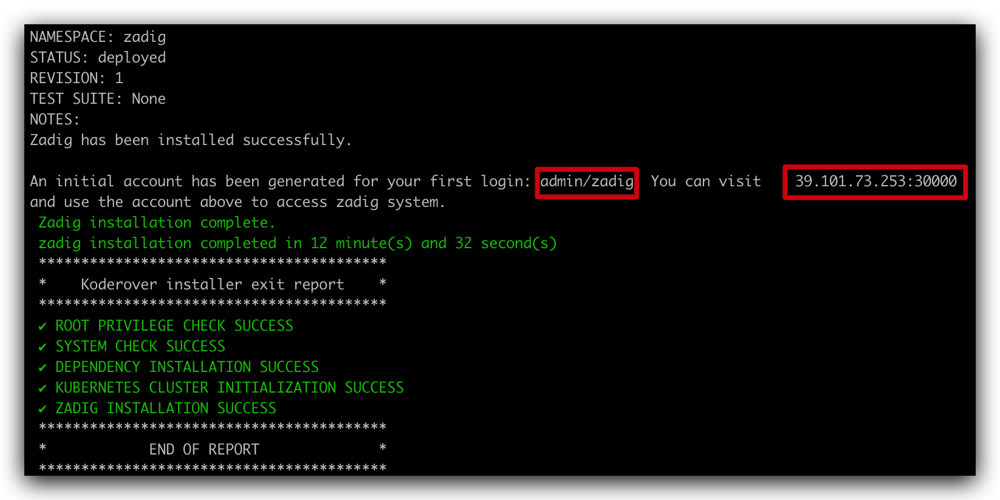

::: warning

 Zadig Nightly 版本是基于最新代码定时发布的快速体验版本。在单台云主机或者虚拟机上安装，适合初次接触 Kubernetes 、快速尝鲜 Zadig 的用户，不可生产使用。
:::
## 步骤 1：准备 Linux 机器

::: tip 提示
为了避免安装时产生冲突或者其它未知错误，建议您的操作系统保持干净的状态，不安装任何可能产生冲突的软件
:::

### 硬件要求

|  操作系统                                               |  最低要求                         |
| ------------------------------------------------------ | ---------------------------------|
| **Ubuntu** 16.04,18.04,20.04                           | CPU: 4 核  内存: 8 GB  硬盘: 50 GB |
| **CentOS** 7.4,7.5,7.6,7.7,7.8,7.9,8.0,8.1,8.2,8.3     | CPU: 4 核  内存: 8 GB  硬盘: 50 GB |


### 网络要求
- 服务器可以访问外网

### 其它
- 需要以 Root 用户安装，不建议用 `sudo`
- 确保服务器可以使用 `curl` 命令
- 确保服务器防火墙配置开放 30000 - 32767 的端口段，用于外部访问
::: tip
- 如果是以 SSH 方式登入机器，为防止脚本等待安装时间过长导致 SSH 连接断开，建议在客户端本地`~/.ssh/config`中添加一行 `ServerAliveInterval 60`
:::

## 步骤 2：下载安装脚本

下载安装脚本并添加可执行权限。
```bash
curl -L https://download.koderover.com/install?type=nightly -o nightly.sh
chmod +x ./nightly.sh
```

::: tip 提示
下表为安装脚本支持配置的环境变量，安装时会使用默认值进行安装，如果有配置的需求，可以在执行安装脚本之前通过环境变量进行配置。
:::

```bash
#例如：配置 IP 访问地址
export IP=<node external ip>
export PORT=<30000~32767 任一端口>
```

| 变量名称                   | 默认值                       | 是否必填         | 说明                                                                                                                                                       |
| -------------------------- | ---------------------------- | ---              | ----------------------                                                                                                                                     |
| NAMESPACE                  | zadig                        | 否               | Kubernetes 命名空间                                                                                                                                        |
| IP                         |                              | 和 DOMAIN 二选一 | 服务器 IP 地址，用于访问 Zadig 系统                                                                                                                        |
| PORT                       |                              | 使用 IP 访问必填 | 30000 - 32767 任一端口                                                                                                                                     |
| DOMAIN                     |                              | 和 IP 二选一     | 访问 Zadig 系统域名                                                                                                                                        |
| NGINX_SERVICE_TYPE         | NodePort                     | 否               | 通过脚本自动安装的 Gateway Proxy 和 Ingress Controller Service 类型为 NodePort，可配置为： LoadBalancer                                                     |
| INGRESS_CLASS              |                              | 否               | 若集群内已经配置了 Nginx Ingress 控制器，则设置这个变量为该控制器的名称                                                                                    |
| INSECURE_REGISTRY          |                              | 否               | 若需要使用一个 HTTP 协议的 Registry，则设置该变量为 Registry 的地址 ，如 10.0.0.1:5000                                                                     |
| STORAGE_CLASS              |                              | 否               | 若集群内支持持久存储卷，可以设置该变量，避免 Zadig 的数据库服务重启后数据丢失                                                                              |
| STORAGE_SIZE               | 20G                          | 否               | 内置数据库和对象存储各自的数据存储大小                                                                                                                     |
| MONGO_URI                  |                              | 否               | Zadig 业务数据存储，若不配置，使用安装脚本中内置的单节点 MongoDB                                                                                           |
| MONGO_DB                   | zadig                        | 否               | MONGO 数据库名称                                                                                                                                           |
| MYSQL_HOST                 | ""                           | 否               | Zadig 用户信息数据存储，若不配置，使用安装脚本中内置的单节点 MySQL                                                                                         |
| MYSQL_PORT                 | ""                           | 否               | MySQL 数据库端口                                                                                                                                           |
| MYSQL_USERNAME             | ""                           | 否               | MySQL 数据库用户名                                                                                                                                         |
| MYSQL_PASSWORD             | ""                           | 否               | MySQL 数据库密码                                                                                                                                           |
| ENCRYPTION_KEY             |                              | 否               | 由安装过程生成，用于数据加密解密，<font color=#FF000 >**第一次安装后请妥善保存**</font>。重装系统时需设置 ENCRYPTION_KEY，才能保证之前的数据可以被正确解密 |
| EMAIL                      | admin@example.com            | 否               | 初始用户邮箱                                                                                                                                               |
| PASSWORD                   | zadig                        | 否               | 初始用户密码                                                                                                                                               |

## 步骤 3：开始安装

执行安装脚本：

```bash
# 服务器 IP 地址，用于访问 Zadig 系统
# 如果您有自己的域名，可以配置您可用的域名 export DOMAIN = <DOMAIN>
# 如果出现端口占用情况，换一个端口再尝试

export IP=<IP>
export PORT=< 30000 - 32767 任一端口>
./nightly.sh
```




安装过程预计持续 30 分钟左右，受硬件配置和网络情况影响，不同环境下的时间可能不同，
当看到如图的输出时，说明安装已经完成。
## 步骤 4：验证安装结果

可以通过命令查看服务启动状态：

```bash
kubectl -n zadig get po
```
## 步骤 5：访问系统



在安装结果输出中，您可以获得系统的访问地址。

## Zadig 卸载

支持使用脚本来一键卸载当前安装的 Zadig 系统，只需执行卸载脚本即可：

```bash
#根据实际安装的 namespace 修改
export NAMESPACE=zadig
curl -SsL https://download.koderover.com/install?type=uninstall | bash
```
